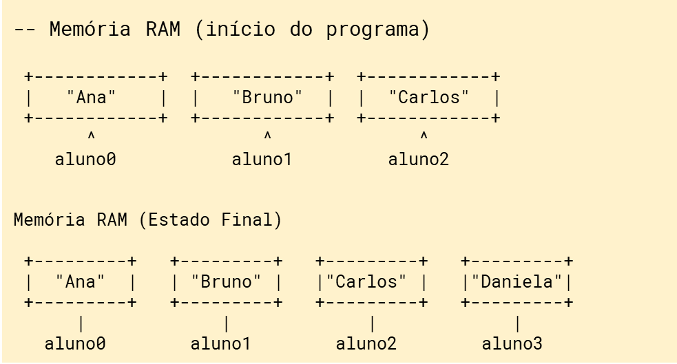
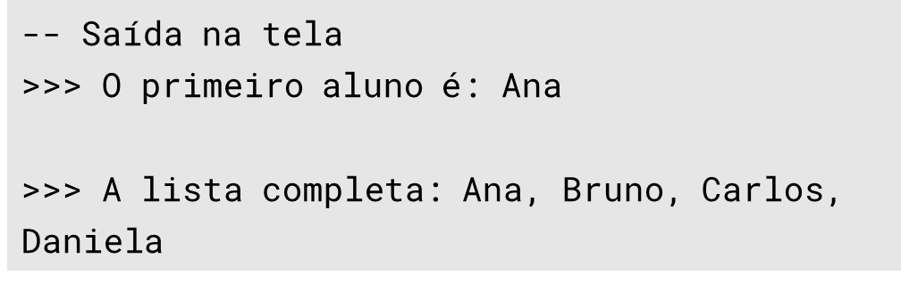
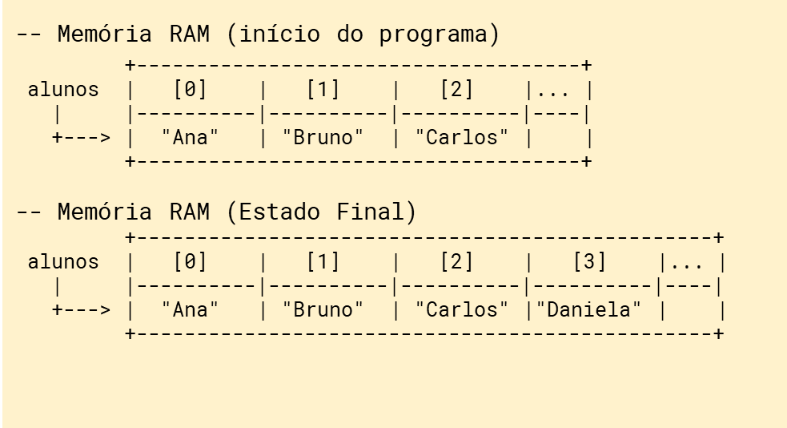
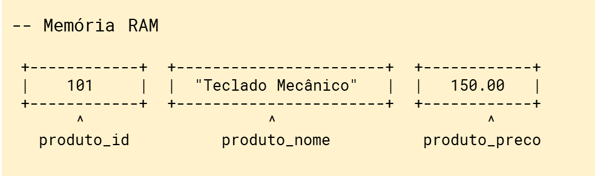
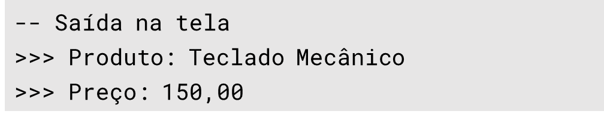
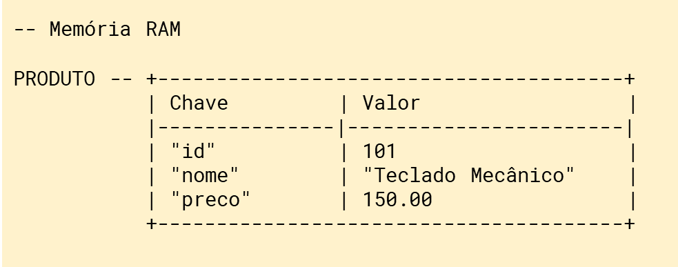
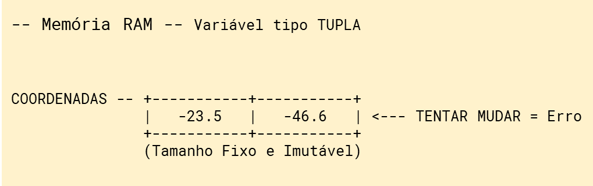
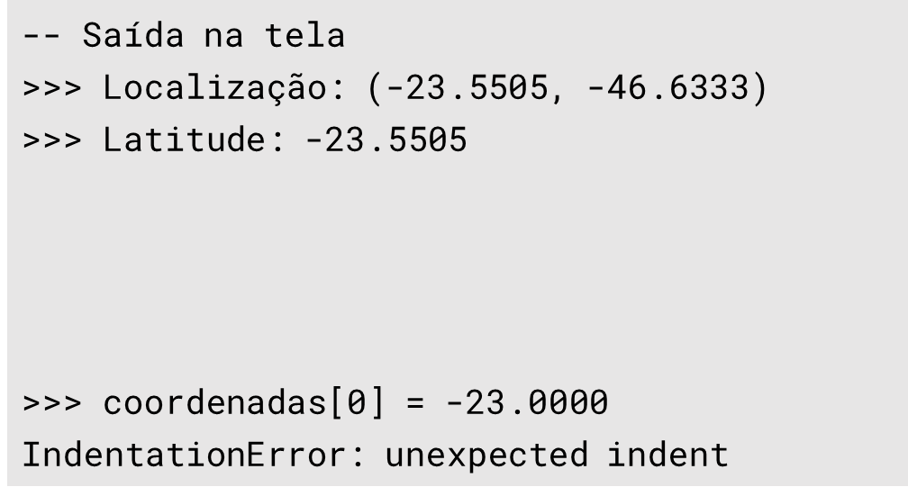
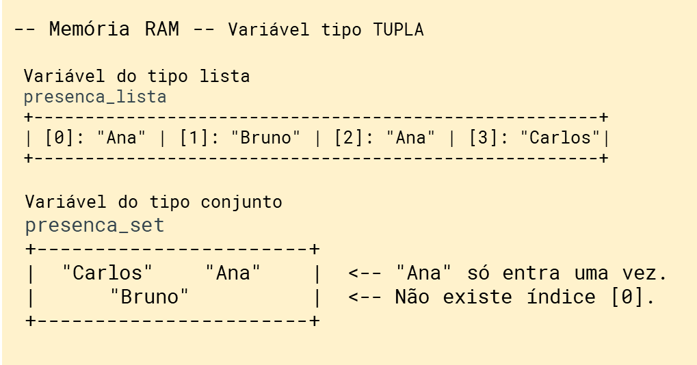
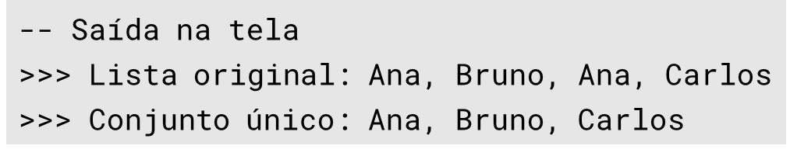

# Variáveis compostas: Listas e Dicionários

Até este ponto, tratamos programas python que utilizavam variáveis simples. Hoje vamos ver como podemos criar coleções de variáveis para armazenar dados em memória.

### O mundo antes do Python

Antigamente, em linguagens como **C** ou **Pascal**, lidar com conjuntos de dados era um desafio de engenharia.

-   **Alocação Estática:** Você precisava dizer ao computador exatamente quantos itens a lista teria antes de começar. Se tentasse colocar o 11º item em um espaço de 10, o programa travava (o famoso *buffer overflow*).
-   **Gerência de Memória:** O programador era responsável por "alocar" o espaço na memória RAM e, mais importante, "liberar" esse espaço quando terminasse. Esquecer disso causava o *memory leak* (vazamento de memória), que deixava o computador lento até travar.
-   **A Revolução do Python:** O Python utiliza um **Coletor de Lixo (Garbage Collector)**. Ele decide sozinho quando uma lista não é mais necessária e limpa a memória para você. Além disso, as listas são dinâmicas: elas crescem e diminuem conforme a necessidade, sem que você precise declarar o tamanho fixo.

### Listas de Dados (Lists) em Python


Em Python, uma **lista** é uma estrutura de dados utilizada para armazenar uma coleção de itens em uma única variável. Elas são extremamente versáteis e uma das ferramentas mais fundamentais para qualquer programador, especialmente em contextos de ciência de dados e engenharia de software.

#### Exemplo 1 - um programa python utilizando variáveis simples

Considere este exemplo em python utilizando variáveis simples. Precisamos cadastrar 4 alunos. Vamos manter esses dados em memória. Considere o preenchimento das variávies na figura abaixo.

+---------------------------------------------------------------------+--------------------------------------+
| ``` python                                                          |  |
| # Criando variáveis simples                                         |                                      |
| aluno0 = "Ana"                                                      |  |
| aluno1 = "Bruno"                                                    |                                      |
| aluno2 = "Carlos"                                                   |                                      |
|                                                                     |                                      |
|                                                                     |                                      |
| # "Adicionando" um novo aluno                                       |                                      |
| # (precisamos criar nova variável )                                 |                                      |
| aluno3 = "Daniela"                                                  |                                      |
|                                                                     |                                      |
|                                                                     |                                      |
| # Acessando o dado                                                  |                                      |
| print(f"O primeiro aluno é: {aluno0}")                              |                                      |
|                                                                     |                                      |
| # Exibindo todos (nomeando um por um)                               |                                      |
| print(f"A lista completa: {aluno0} , {aluno1}, {aluno2}, {aluno3}") |                                      |
| ```                                                                 |                                      |
+---------------------------------------------------------------------+--------------------------------------+

#### Continuação - Exemplo 1 - convertendo variáveis simples uma variável "Lista"

Vamos agora refazer o mesmo exemplo utilizando o tipo de variáveis "Lista", que como o próprio nome sugere, cria uma estrutura de dados em memória em formato de uma lista de variáveis.

+------------------------------------------+--------------------------------------+
| ``` python                               |  |
| # Criando uma lista de alunos            |                                      |
| alunos = ["Ana", "Bruno", "Carlos"]      |  |
|                                          |                                      |
|                                          |                                      |
|                                          |                                      |
| # Adicionando um novo aluno              |                                      |
| alunos.append("Daniela")                 |                                      |
|                                          |                                      |
|                                          |                                      |
|                                          |                                      |
|                                          |                                      |
| # Acessando pelo índice                  |                                      |
| #(começa na posição ZERO)                |                                      |
| print(f"Oprimeiro aluno é: {alunos[0]}") |                                      |
|                                          |                                      |
|                                          |                                      |
| print(f"A lista completa: {alunos}")     |                                      |
| ```                                      |                                      |
+------------------------------------------+--------------------------------------+

#### **Atividade Prática do Exemplo 1 (Notepad++):**

No windows, abra o Notepad++, crie um arquivo chamado `exemplo_01_listas.py` e digite:

``` python
# Criando uma lista de alunos
alunos = ["Ana", "Bruno", "Carlos"]

# Adicionando um novo aluno
alunos.append("Daniela")

# Acessando pelo índice (Lembre-se: começa no ZERO)
print(f"O primeiro aluno é: {alunos[0]}")
print(f"A lista completa: {alunos}")
```

#### **Como executar:**

1.  Abra o **`cmd.exe`**.

2\. Navegue até a pasta do arquivo `exemplo_01_listas.py` que você criou.

3\. Digite: **python**`exemplo_01_listas.py`.

------------------------------------------------------------------------

### Dicionário de Dados em Python


Se a lista é uma fila, o dicionário é uma **etiqueta**. Em vez de usar um número (índice) para achar algo, usamos uma **Chave (Key)**. Isso é ideal para representar uma "linha de uma tabela" de banco de dados.

#### Exemplo 2 - um programa python utilizando variáveis simples

**Exemplo: Representando um Produto** Imagine uma linha de uma tabela de estoque:

| ID  | Nome    | Preço  |
|:----|:--------|:-------|
| 101 | Teclado | 150.00 |

+-------------------------------------+--------------------------------------+
| ``` python                          |  |
| # --- MODO: VARIÁVEIS SIMPLES       |                                      |
|                                     |  |
| # cadastro de um produto            |                                      |
| produto_id = 101                    |                                      |
| produto_nome = "Teclado Mecânico"   |                                      |
| produto_preco = 150.00              |                                      |
|                                     |                                      |
| # Acessando a informação            |                                      |
| # pelo nome da variável específica  |                                      |
|                                     |                                      |
| print(f"Produto: {produto_nome}")   |                                      |
| print(f"Preço: R$ {produto_preco}") |                                      |
| ```                                 |                                      |
+-------------------------------------+--------------------------------------+

#### Continuação - Exemplo 2 - convertendo variáveis simples uma variável "Dicionário"

+----------------------------------------+--------------------------------------+
| ``` python                             |  |
| # Variável do tipo “Dicionário”        |                                      |
| produto = {                            |  |
|     "id"   : 101,                      |                                      |
|     "nome" : "Teclado Mecânico",       |                                      |
|     "preco": 150.00                    |                                      |
| }                                      |                                      |
|                                        |                                      |
|                                        |                                      |
|                                        |                                      |
| # Acessando a informação pela chave    |                                      |
| print(f"Produto: {produto['nome']}")   |                                      |
| print(f"Preço: R$ {produto['preco']}") |                                      |
| ```                                    |                                      |
+----------------------------------------+--------------------------------------+

#### **Atividade Prática do Exemplo 2 (Notepad++):**

Crie o arquivo `exemplo_02_dicionario.py`:

``` python
# Representando uma linha de tabela
produto = {
    "id": 101,
    "nome": "Teclado Mecânico",
    "preco": 150.00
}

# Acessando a informação pela chave
print(f"Produto: {produto['nome']}")
print(f"Preço: R$ {produto['preco']}")
```

#### **Como executar:**

1.  Abra o **`cmd.exe`**.

2\. Navegue até a pasta do arquivo `exemplo_02_dicionario.py` que você criou.

3\. Digite: **python**`exemplo_02_dicionario.py`.

------------------------------------------------------------------------

### Dados tipo TUPLA em Python


O tipo tuple (tupla) em Python é uma estrutura de dados ordenada, imutável e indexada, utilizada para armazenar uma coleção de elementos. Diferente da lista (list), a tupla não pode ser alterada após sua criação.

#### Exemplo 3 - um programa python utilizando uma variável TUPLA

+--------------------------------------------+--------------------------------------+
| ``` python                                 |  |
| # Criando uma Tupla (Latitude e Longitude) |                                      |
|                                            |  |
| coordenadas = (-23.5505, -46.6333)         |                                      |
|                                            |                                      |
|                                            |                                      |
|                                            |                                      |
|                                            |                                      |
| print(f"Localização: {coordenadas}")       |                                      |
| print(f"Latitude: {coordenadas[0]}")       |                                      |
|                                            |                                      |
|                                            |                                      |
| # TENTANDO ALTERAR                         |                                      |
| #(Isso causará um ERRO no cmd.exe)         |                                      |
|                                            |                                      |
|                                            |                                      |
| coordenadas[0] = -23.0000                  |                                      |
| ```                                        |                                      |
+--------------------------------------------+--------------------------------------+

#### **Atividade Prática do Exemplo 3 (Notepad++):**

Crie o arquivo `exemplo_03_tupla.py`:

``` python
# Criando uma Tupla (Latitude e Longitude)

coordenadas = (-23.5505, -46.6333)


print(f"Localização: {coordenadas}")
print(f"Latitude: {coordenadas[0]}")


# TENTANDO ALTERAR 
#(Isso causará um ERRO no cmd.exe)


coordenadas[0] = -23.0000
```

#### **Como executar:**

1.  Abra o **`cmd.exe`**.

2\. Navegue até a pasta do arquivo `exemplo_03_tupla.py` que você criou.

3\. Digite: **python**`exemplo_03_tupla.py`.

------------------------------------------------------------------------

### Dados tipo Conjuntos (SET) em Python

Para fechar o trio de estruturas de dados essenciais, vamos incluir o **Conjunto (`set`)**. Conjuntos são estruturas de dados semelhantes as filas, porém seus dados são únicos.

#### Exemplo 4 - um programa python utilizando uma variável CONJUNTO

+------------------------------------------------------------+--------------------------------------+
| ``` python                                                 |  |
| # Uma lista com nomes repetidos                            |                                      |
| presenca_lista = ["Ana","Bruno", "Ana", "Carlos", "Bruno"] |  |
|                                                            |                                      |
|                                                            |                                      |
| # Convertendo para Conjunto (set) para remover duplicatas  |                                      |
| presenca_set = {"Ana","Bruno", "Ana", "Carlos", "Bruno"}   |                                      |
|                                                            |                                      |
|                                                            |                                      |
|                                                            |                                      |
|                                                            |                                      |
|                                                            |                                      |
|                                                            |                                      |
|                                                            |                                      |
|                                                            |                                      |
|                                                            |                                      |
|                                                            |                                      |
| print(f"Lista original:{presenca_lista}")                  |                                      |
| print("Conjunto único: {presenca_set}")                    |                                      |
| ```                                                        |                                      |
+------------------------------------------------------------+--------------------------------------+

#### **Atividade Prática do Exemplo 4 (Notepad++):**

Crie o arquivo `aula_exemplo_04_conjunto.py`:

``` python
# Uma lista com nomes repetidos
presenca_lista = ["Ana", "Bruno", "Ana", "Carlos", "Bruno"]


# Convertendo para Conjunto (set) para remover duplicatas
presenca_set = {"Ana", "Bruno", "Ana", "Carlos", "Bruno"}

print(f"Lista original:{presenca_lista}")
print(f"Conjunto único: {presenca_set}")
```

#### **Como executar:**

1.  Abra o **`cmd.exe`**.

2\. Navegue até a pasta do arquivo `aula_exemplo_04_conjunto.py` que você criou.

3\. Digite: **python**`aula_exemplo_04_conjunto.py`.

### 4. Dica de Ouro: Python Tutor

Se você executar o código no CMD e não conseguir visualizar o que está acontecendo "dentro" da memória do computador, copie seu código e cole no [Python Tutor](https://pythontutor.com/).

-   Clique em **"Visualize Execution"**.
-   Use o botão **"Next"** para ver o Python criando as "setas" que apontam para os endereços de memória. É a melhor forma de entender como o dicionário associa uma chave a um valor.

------------------------------------------------------------------------

```{r aula-listas_e_dicionarios-06-aula-html, eval=FALSE, include=FALSE}
rmarkdown::render("06-2026-04-08_Listas_e_Dicionarios.Rmd", output_dir="docs", output_file ="temporario.html" , output_format = "html_document") ; utils::browseURL("docs/temporario.html")
```

```{r aula-listas_e_dicionarios-06-aula-word, eval=FALSE, include=FALSE}
rmarkdown::render("06-2026-04-08_Listas_e_Dicionarios.Rmd", output_dir="docs", output_file ="temporario.docx" , output_format = "word_document") ; utils::browseURL("docs/temporario.docx")
```
